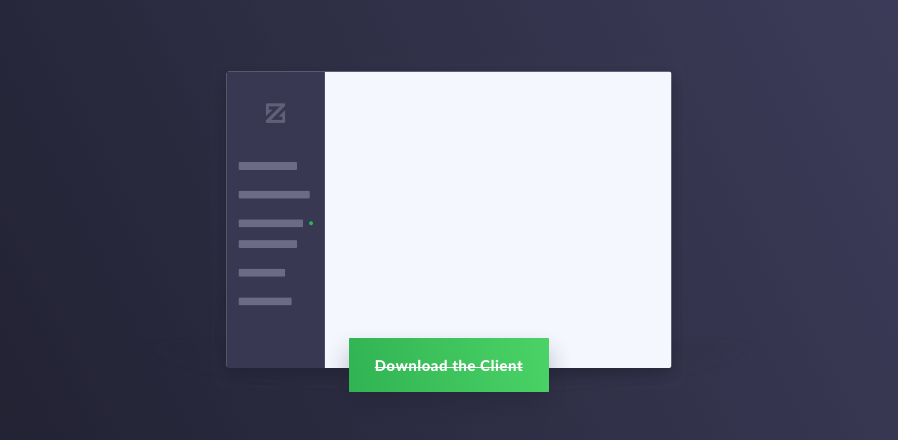

# Zcoin Client



This is an (experimental) client for the [Zcoin](https://zcoin.io/) network. Currently, it requires connection to a
fully trusted zcoind full node.

## Installing zcoind

For an unbundled install, it's required that you manually link binaries compiled from the `client-api` branch of the
[zcoin repository](https://github.com/zcoinofficial/zcoin) into the appropriate directory for your system.

### Pulling and Building zcoind

Clone the zcoind repository

```bash
git clone --branch client-api https://github.com/zcoinofficial/zcoin
```

Now you must build zcoind, instructions for which will be located in `doc/build`, in the `README*.md` and `build*.md`
files relevant to your platform. In addition to the instructions included there, the additional flag `--enable-clientapi`
must be passed to the `./configure` script when it is invoked during the build process as described in the aforementioned
files. (If this flag is not passed correctly during the buld process, the client will timeout on bootup with an unhelpful
error message.)

Once zcoind is built, the relevant binaries will be located in `./zcoin/src/`.

Now you must make copy the zcoind binary into the appropriate assets directory, either `assets/core/win32`,
`assets/core/linux`, or `assets/core/darwin`. e.g.
`mkdir -p assets/core/linux && cp ../zcoin/src/zcoind assets/core/linux`. In order to compile Zcoin Client binaries on
other platforms, you must include zcoind binaries built for that platform in the appropriate directory.

#### Updating zcoind

To update `zcoind`, simply run `git pull` in the `zcoind` directory, and run `./autogen.sh`, `./configure`, and `make`
with the arguments you previously used following your platform-specific build instructions.

## Installing npm Packages

To install dependencies for the client itself, run

```bash
npm install
```

## Installing Electron

You must also install [Electron](https://electronjs.org/). We're currently developing on Electron version `3.0.8`.

## Starting zcoin-client

To run the development version of zcoin-client, simply run

```bash
npm run dev
```

### Debug Levels

By default, zcoin-client will log to `userData/combined.log` in the application data directory at debug level. This
can be changed with the environment variable `ZCOIN_CLIENT_DEBUG_LEVEL`.

## REPL

If the client is started with the `ZCOIN_CLIENT_REPL` environment variable set to `true`, the client will not start
and instead Chrome Dev Tools will be launched with the global variable Zcoind set to the Zcoind class from
`src/daemon/zcoind.ts`. It can then be used to interact with the daemon as documented in that file. The daemon will
NOT be stopped automatically on exit.

## Getting Assistance

If you need assistance with this project, you can join the official Zcoin Telegram group
[@zcoinproject](https://t.me/zcoinproject)
